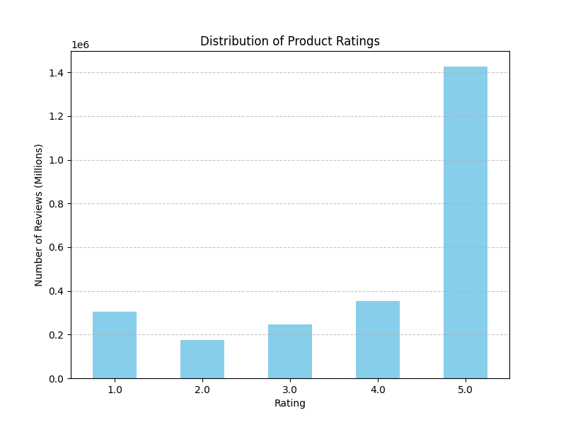
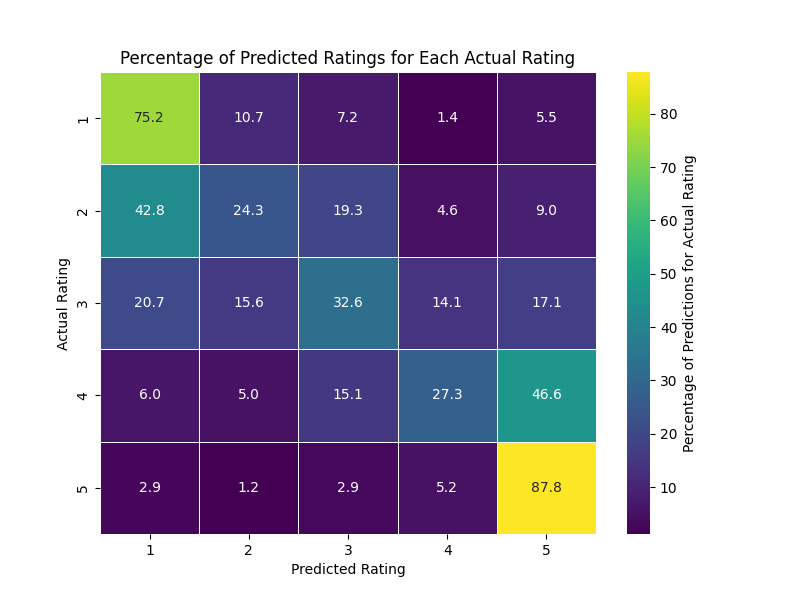
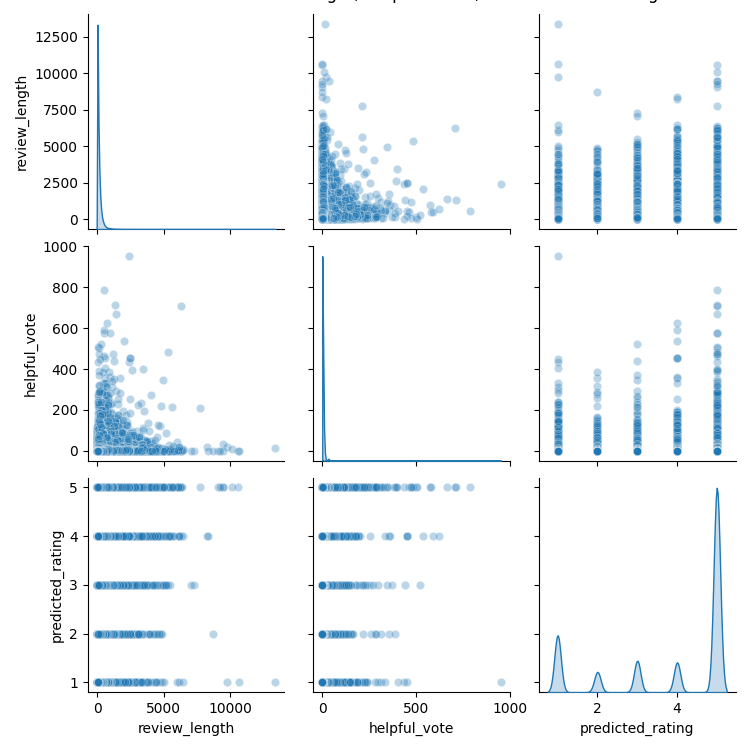

## Metadata

**Goal:**  
The goal of this project is to build a predictive model that can estimate product ratings on Amazon based on the text of user reviews with at least 80% accuracy. By analyzing word frequencies and assigning appropriate weightings, we aim to better capture the relationship between written sentiment and numerical ratings.

**Summary:**  
We are investigating how textual features in Amazon product reviews correlate with user-assigned star ratings. Our approach leverages weighted keyword analysis combined with a linear Support Vector Classifier (SVC), trained on TF-IDF representations of review text. The model will help reveal whether specific words or patterns tend to bias ratings higher or lower and serve as a supplementary tool for potential buyers by contextualizing user reviews.

**License/Provenance:**  
Our data was sourced from the [Amazon Reviews'23 GitHub page](https://amazon-reviews-2023.github.io/), created and hosted by the McAuley Lab at the University of California, San Diego. As the title infers, this was published in 2023. The site has datasets, for both reviews and products, spanning various categories of Amazon's inventory. In particular, we chose to analyze the `Amazon_Fashion` dataset, as it provided a large dataset (2.5 millions reviews) with a more even distribution of ratings compared to other categories of simimlar sizes. We also felt as if it would similarly reflect the reviews of `Clothing_Shoes_and_Jewelry`, which is the second largest dataset. Our data was cleaned from the `.jsonl` file (the raw from retrieved from UCSD) to the `.csv` file, both of which are within this folder. The CSV was cleaned to contain only relevant columns, which are seen below.

**Data Dictionary:**

| Variable Name      | Short Description                                                        | Example Values                                      |
|--------------------|--------------------------------------------------------------------------|-----------------------------------------------------|
| rating             | The star rating as a fixed integer. Higher is better.                    | 1.0 (min), 3.0, 5.0 (max)                           |
| title              | The rating’s title. This string is usually a brief phrase or sentence.   | “Meh”, “Quick Arrival”                              |
| text               | The content of the review as a string. Usually 1-3+ sentences.           | [Examples from an Amazon Listing](https://www.amazon.com/product-reviews/B095CPRN9T/ref=cm_cr_dp_d_show_all_btm?ie=UTF8&reviewerType=all_reviews) |
| helpful_vote       | The number of times other users found this review helpful/accurate.       | 0, 5, 108                                           |
| verified_purchase  | A boolean that determines whether this review was tied to a purchase.     | true, false                                         |
| product_id         | The ID of the product being reviewed. Used to group reviews by product.   | “BO88SZDGXG”                                        |                     |
| predicted_rating*   | The Linear SVC’s prediction for what the rating would be, based on text. () | 1.0 (min), 3.0, 5.0 (max)                           |

*Note: predicted_rating will be a member of `output/final_data.csv`, not part of the CSV file within the `data/` folder.

**Ethical Considerations:**
- The dataset we're interacting with is publically avaiable, with reviews of consenting users considering the format of Amazon's platform.
- No sensitive or private information of the user's involved is included in the data.
- All analyses are original and no not fabricate false data.
- External sources are properly credited and cited below.

**Goal put another way:**  
We want to create a system that translates review text into an estimated star rating, revealing how specific words influence perception of product quality. In other words, we aim to uncover and quantify the relationship between customer language and numerical ratings, and then test if this quantified relationship can generalize into an accurate prediction model.

**Exploratory Plots:**

1. Number of reviews for each star rating  
   
2. Predicted vs Actual plot (percentage distribution based on the actual)  
   
3. Scatter plots of review length, number of helpful votes, and predicted rating  
   

## References

[1] Amazon Reviews 2023. [Online]. Available: [https://amazon-reviews-2023.github.io/](https://amazon-reviews-2023.github.io/). [Accessed: Sep. 10, 2025].

[2] B. Lutz, N. Pröllochs, and D. Neumann, “Understanding the Role of Two-Sided Argumentation in Online Consumer Reviews: A Language-Based Perspective,” *arXiv preprint arXiv:1810.10942*, 2018. [Online]. Available: [https://arxiv.org/pdf/1810.10942](https://arxiv.org/pdf/1810.10942). [Accessed: Sep. 10, 2025].

[3] T. Joachims, “Text categorization with Support Vector Machines: Learning with many relevant features,” in *Lecture notes in computer science*, 1998, pp. 137–142. doi: 10.1007/bfb0026683. [Accessed: Sep. 10, 2025].